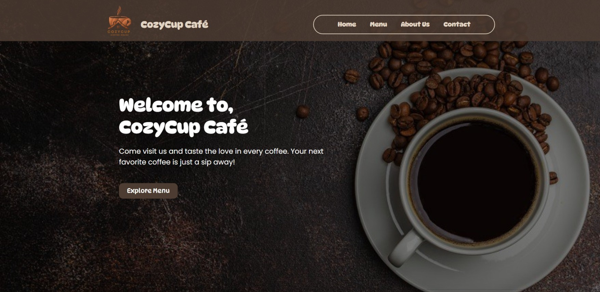
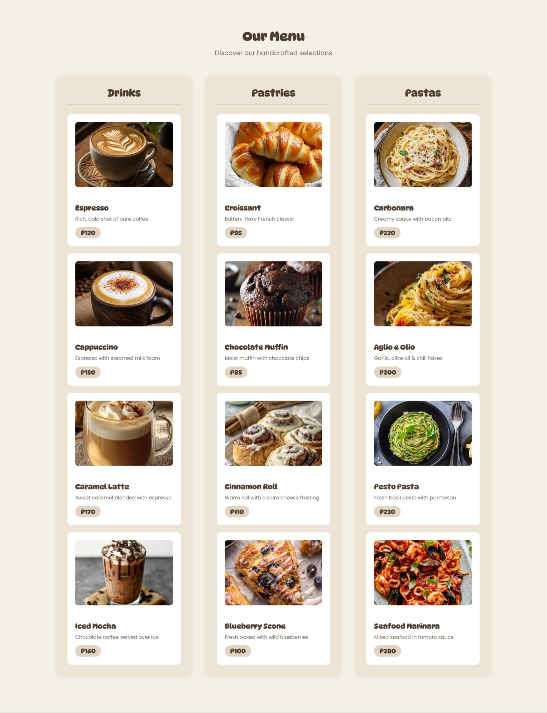
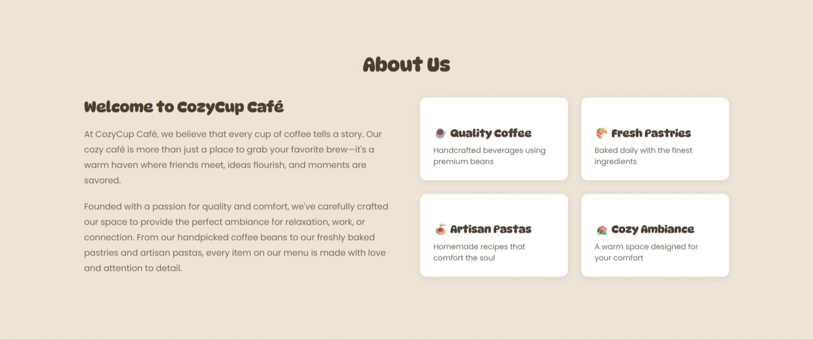
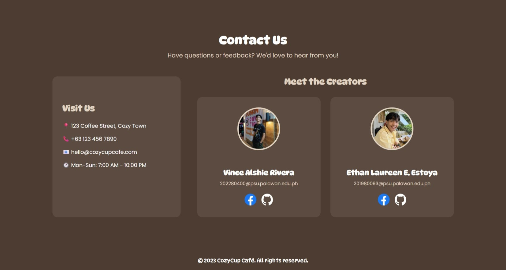
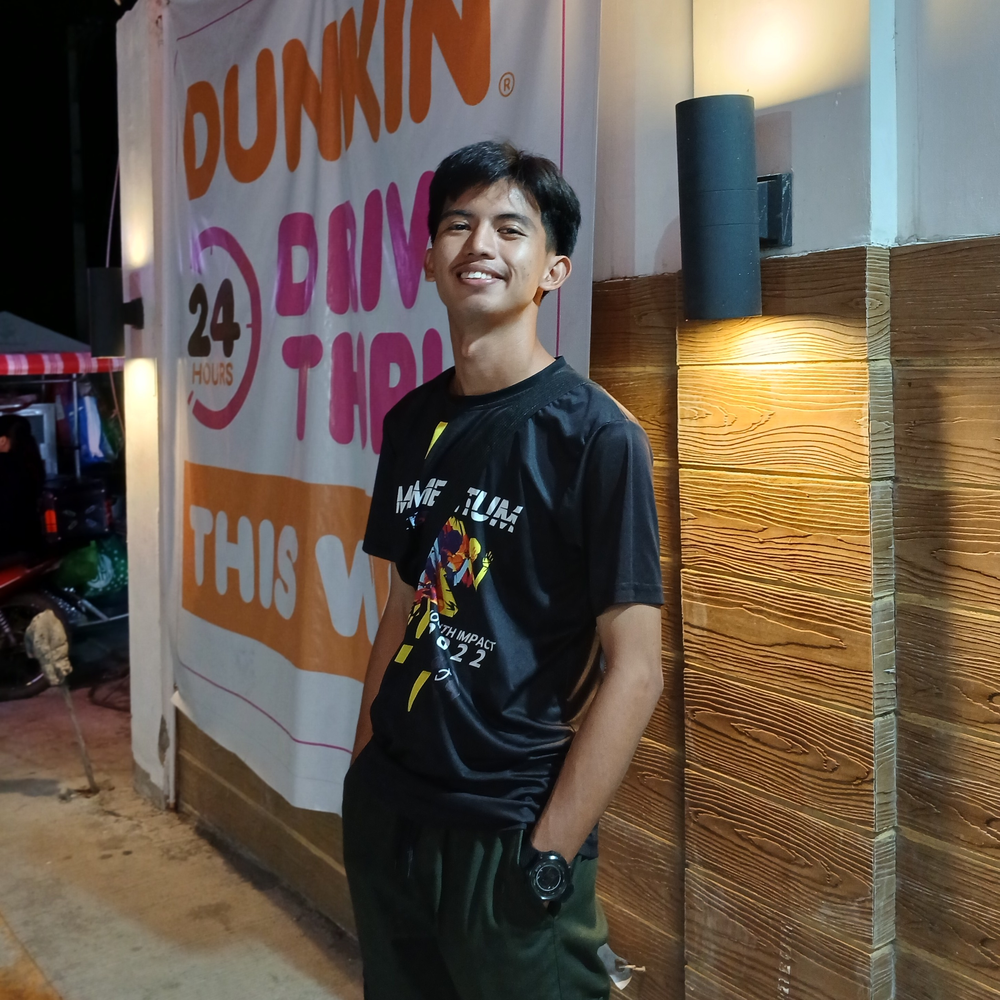
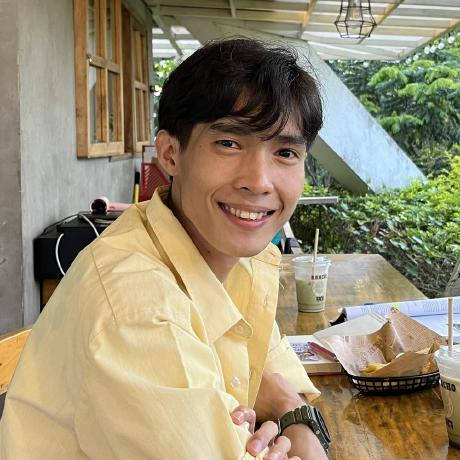

# Cozy Cup Cafe ☕

### Project Description
Cozy Cup Cafe is a simple and cozy-themed website designed for a café business. It showcases the café’s menu, ambiance, and brand while providing users with an easy and pleasant browsing experience.

### Features
* Clean and cozy cafe-themed UI design
* Responsive layout for desktop and mobile devices
* Menu section with food and drink listings
* Simple navigation for better user experience
* Modern and minimal design style

## Screen Captures

**Homepage** – Displays the welcoming design and branding of Cozy Cup Cafe.

**Menu Page** – Shows the available drinks and food items offered by the café.

**About Page** – Provides information about the café’s story and vision.

**Contact Page** – Allows users to find contact details and reach the café easily.

## 👤 About the Authors

 

*Name:* **Vince Alshie Rivera**  
*Email:* [202280400@psu.palawan.edu.ph](mailto:202280400@psu.palawan.edu.ph)  
*Connect with Vince:*
 
  

 

*Name:* **Ethan Laureen E. Estoya**  
*Email:* [201980093@psu.palawan.edu.ph](mailto:201980093@psu.palawan.edu.ph)  
*Contact with Ethan:* 
 
  

